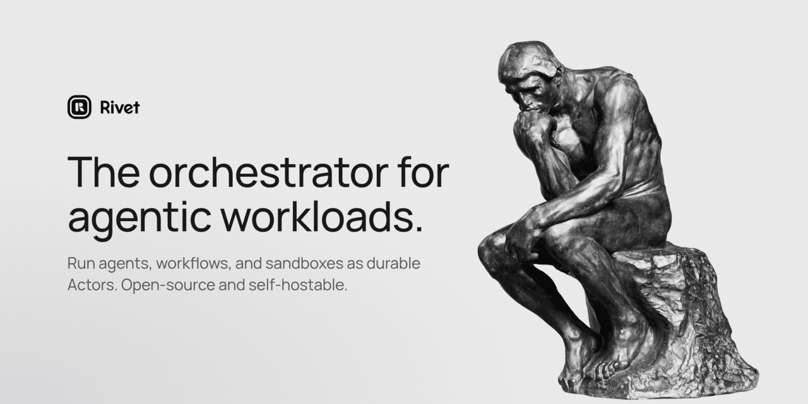

<div align="center">
  <a href="https://www.rivet.dev">
    <!-- Derived from the site-wide Open Graph card (public/images/og/default.png), cropped to GitHub's 2:1 social-preview size:
         magick public/images/og/default.png -crop 2400x1200+0+60 +repage -resize 1280x640 -strip .github/media/social-preview.png -->
    
  </a>
  <br/>
  <br/>
  <h3>The orchestrator for agentic workloads.</h3>
  <p>Run agents, workflows, and sandboxes as durable Actors. Open-source and self-hostable.</p>
  <p>
    <a href="https://www.rivet.dev">Website</a> •
    <a href="https://www.rivet.dev/docs">Documentation</a> •
    <a href="https://www.rivet.dev/blog">Blog</a> •
    <a href="https://www.rivet.dev/discord">Discord</a> •
    <a href="https://x.com/rivet_dev">X</a>
  </p>
</div>

## About this repository

This is the source for [rivet.dev](https://www.rivet.dev): the marketing pages,
product documentation, guides, deployment docs, and blog. It is an
[Astro](https://astro.build) site with React islands and Tailwind CSS.

Looking for Rivet itself? The control plane, SDKs, and Actors live in
[`rivet-dev/rivet`](https://github.com/rivet-dev/rivet). agentOS lives in
[`rivet-dev/agentos`](https://github.com/rivet-dev/agentos).

## How the docs are assembled

Most documentation is authored in a product's own repository and synced into
[`vendor/<bundle>/`](./vendor) by the [`sync-docs`](./.github/actions/sync-docs)
action: one bundle per product (`actors`, `agentos`, `workflows`, …) plus the
site-wide `docs` (general docs at `/docs/`) and `api` (HTTP API reference at
`/docs/api/`) bundles from `rivet-dev/rivet`. The Agents and Rivet Cloud docs
are owned by this repo and live in [`agents/`](./agents) and [`cloud/`](./cloud).

`pnpm assemble` ([`scripts/assemble.ts`](./scripts/assemble.ts)) links every
bundle into `src/content/docs/<bundle>`, preferring a sibling checkout
(`../<repo>`) when one exists so you can preview local docs changes before they
land upstream.

`vendor/` is generated. Do not edit it by hand; CI rejects the change, and the
next sync would overwrite it anyway. Fix those docs in the repo that owns them.

## Layout

| Path | What lives there |
| --- | --- |
| `src/pages/` | Routes: marketing pages, `/docs`, `/guides`, `/blog`, per-product docs |
| `src/content/` | Website-owned content: blog posts, guides, self-host guides, product overviews |
| `src/components/` | Astro and React components, including the marketing design system |
| `src/sitemap/` | Product metadata and the route prefixes every href is derived from |
| `src/data/` | Structured copy: FAQs, comparisons, the integrations registry |
| `examples/docs/` | Snippet files embedded in website-owned docs with `<CodeSnippet>` |
| `agents/`, `cloud/` | Docs bundles authored in this repo (Agents, Rivet Cloud) |
| `vendor/` | Synced docs bundles: products, general docs, HTTP API reference (generated, read-only) |
| `packages/` | Workspace packages: `@rivet-gg/icons`, `@rivet-gg/components`, `@rivetkit/shared-data` |
| `public/` | Static assets: fonts, brand marks, Open Graph cards |
| `scripts/` | Build, assemble, search indexing, OG rendering, and SEO checks |

[`CLAUDE.md`](./CLAUDE.md) holds the writing and design conventions (terminology,
typography, theme, product marks). [`HIDDEN.md`](./HIDDEN.md) lists what is
deliberately unpublished and why.

## Develop

Requires Node.js 22 and pnpm 10.

```bash
pnpm install
pnpm dev          # assembles docs and generates markdown first, then starts Astro on http://localhost:4321
```

Other useful commands:

```bash
pnpm build          # production build (assembles docs, generates markdown and skills first)
pnpm lint           # eslint
pnpm check:sitemap  # sidebars, generated routes, and content files all agree
pnpm render:og      # re-render Open Graph cards after editing src/lib/ogImage.ts
pnpm new-post       # scaffold a blog post
```

Docs code blocks are real files inlined at build time by `<CodeSnippet>`; a
missing file or region fails the build.

## Contributing

- **Website copy, guides, blog, design, Agents and Rivet Cloud docs:** open a
  pull request here.
- **Product docs** (Actors, agentOS, Workflows, Dynamic Apps, Secure Exec,
  Integrations) and the general docs and HTTP API reference: edit them in the
  repository that owns them. They sync here automatically.
- **Bugs and requests:** [open an issue](https://github.com/rivet-dev/website/issues).

Follow the conventions in [`CLAUDE.md`](./CLAUDE.md); they apply to humans and
coding agents alike.

## Community

- [Discord](https://www.rivet.dev/discord)
- [X](https://x.com/rivet_dev)
- [LinkedIn](https://www.linkedin.com/company/72072261/)
- [GitHub Discussions](https://github.com/rivet-dev/rivet/discussions)

## License

[Apache 2.0](./LICENSE)
